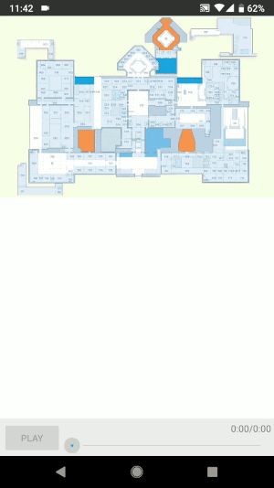
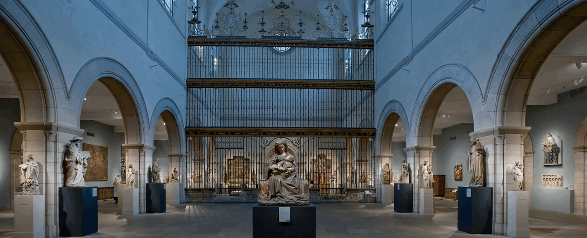
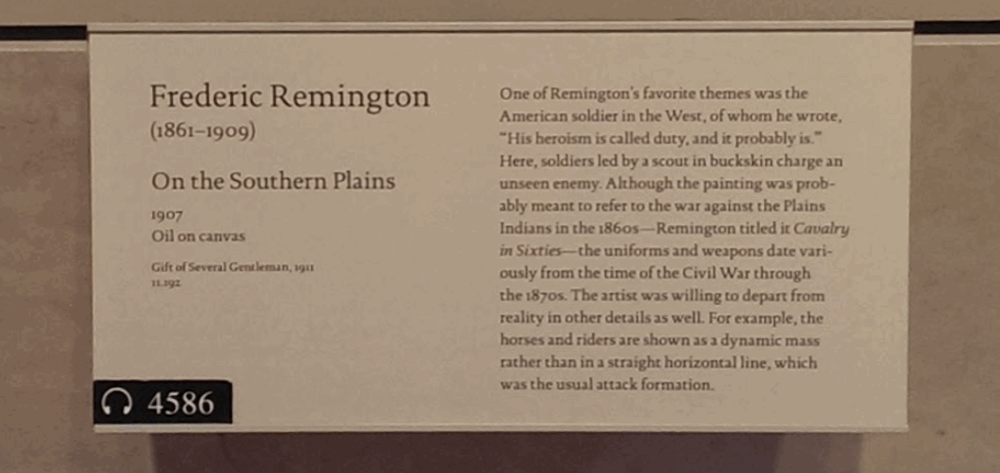
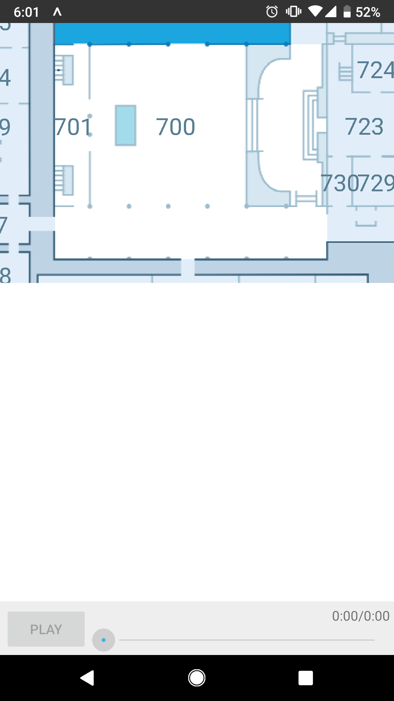
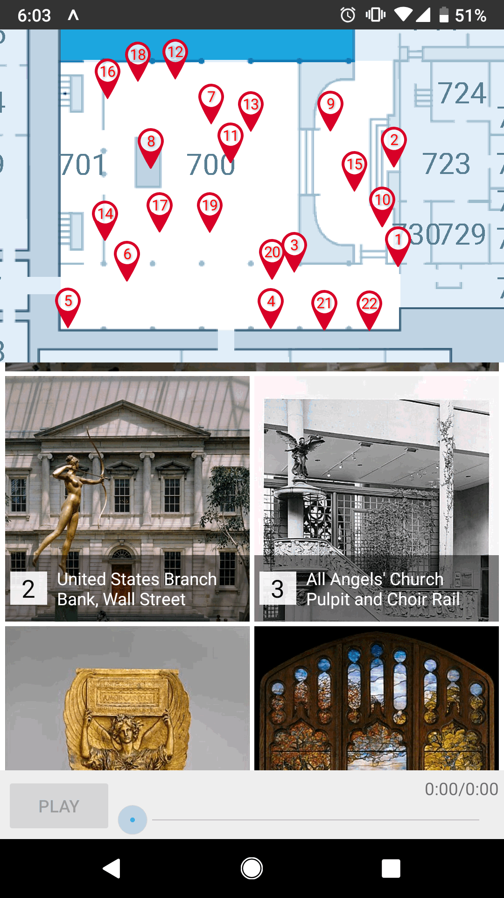
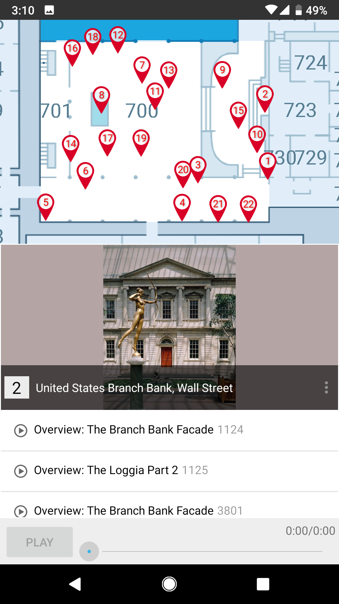
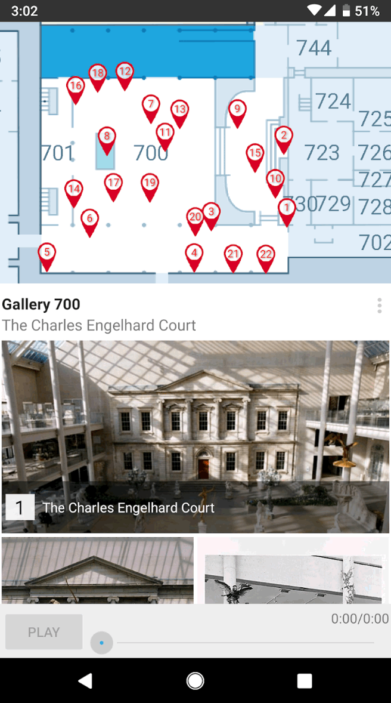
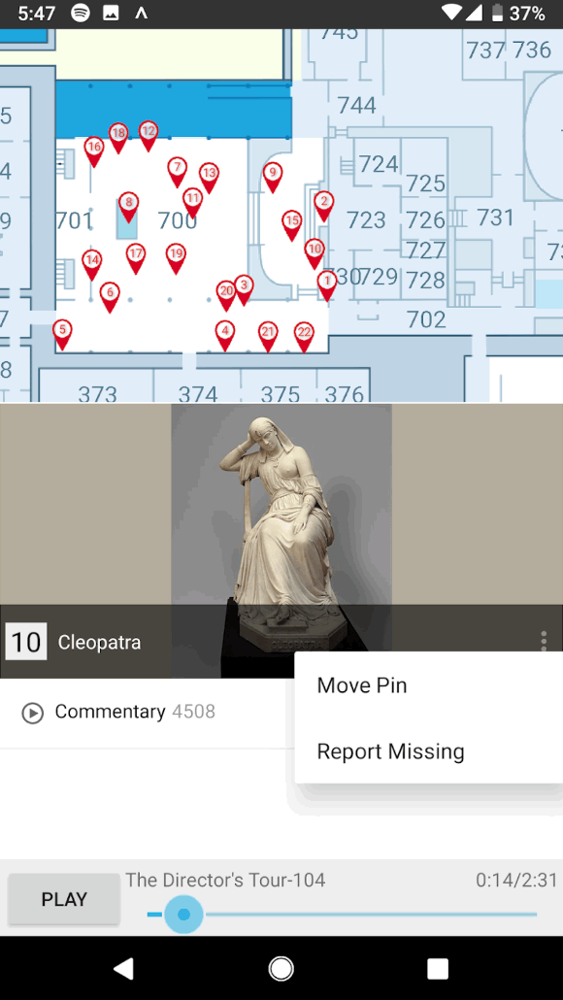

# Unofficial Metropolitan Museum of Art Audio Guide

Indisputably the Metropolitan Museum of Art (MET) in New York City is an incredible place. The MET has 2 million art objects in their permanent collection, their collection is expansive and awe-inspiring. In an effort to put as many objects on display as possible it has left little room to provide a rich description of the wider context and importance of these art objects. Given the ubiquity of smartphones, it is now possible to present a deeper meaning of the object through audio guides without sacrificing display space. The MET has recorded thousands of excerpts from curators and field experts and has provided them for free in their Metropolitan Museum of Art app. As a museum-goer and user of their app, I find it frustrating to exclusively find and listen to audio guides due to a few key design decisions thus I created a new MET audio guide as an attempt to improve upon these pain points: 

## Discoverability 
### Official App: 
 
	
A single gallery within the MET can contain hundreds of art objects and often only a small fraction will feature an audio companion. In order to listen to every audio excerpt in the gallery, a user would need to walk around the gallery and search hundreds of art object descriptions to determine if there’s an audio guide number. In the rare event that they find an audio guide number then they’ll need to punch that number into the official MET app in order to play the audio excerpt.  

### Unofficial App: 
  

The user taps on the gallery they’re interested in. The app will show a thumbnail of every art object that has an audio guide and displays pins that mark their locations. The pin and thumbnail make it easy to locate the object while browsing the gallery. Playing an audio excerpt requires just one extra tap on the art object image.  
 
## Curated Sequence
Gallery 700 (depicted below) has 5 entrances. At the South-southeast entrance (near pin 1) there’s a great overview of the gallery with a corresponding audio guide number. If a museum-goer enters through any of the other 4 entrances then they will likely miss the overview entirely or will listen to it after several other stops. 

### Unofficial App: 
Gallery overviews always appear first. 

## Crowd Sourcing Information
In the face of rotating collections, maintaining an accurate set of art object locations is a tedious task. We can partially unload the burden of this task onto users by asking them to report if an object is missing or moved. Once a quorum is reached then we can reflect this change to all users. 

